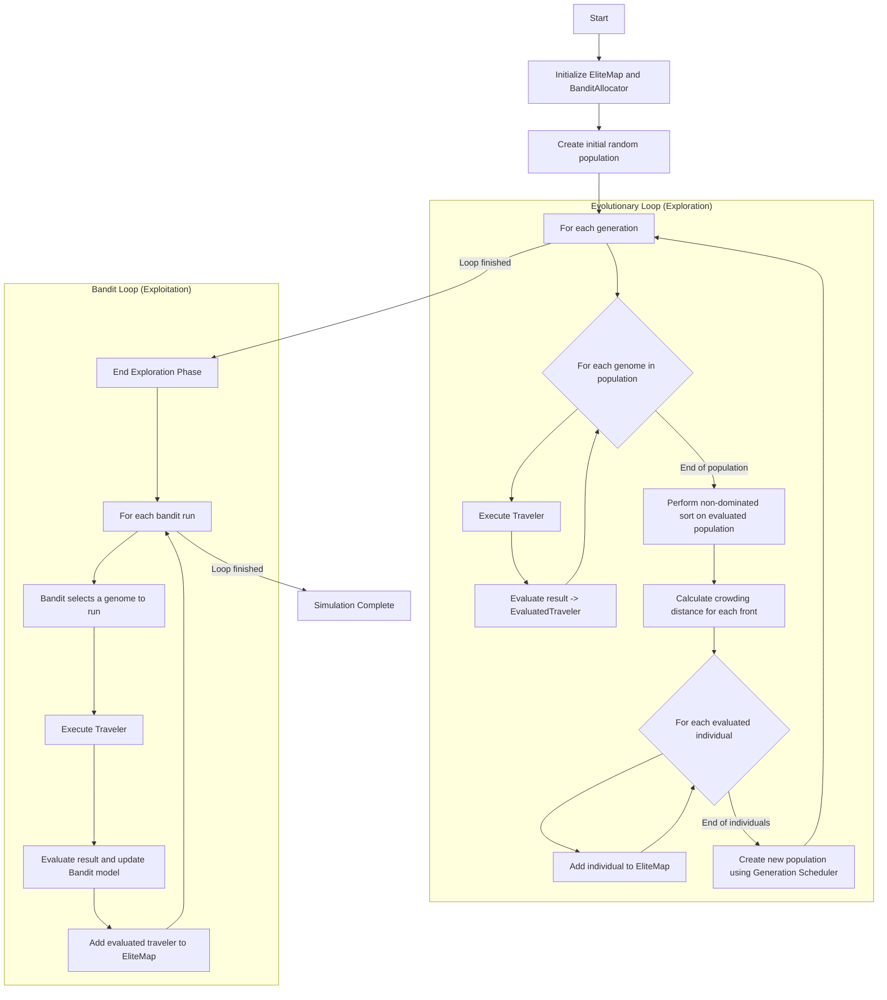

## Main Execution Flow

```mermaid
graph TD
    A[Start] --> B[Initialize EliteMap and BanditAllocator];
    B --> C[Create initial random population];
    
    subgraph "Evolutionary Loop (Exploration)"
        D[For each generation] --> E{For each genome in population};
        E --> F[Execute Traveler];
        F --> G[Evaluate result -> EvaluatedTraveler];
        G --> E;
        E -- End of population --> H[Perform non-dominated sort on evaluated population];
        H --> I[Calculate crowding distance for each front];
        I --> J{For each evaluated individual};
        J --> K[Add individual to EliteMap];
        K --> J;
        J -- End of individuals --> L[Create new population using Generation Scheduler];
        L --> D;
    end

    C --> D;
    D -- Loop finished --> M[End Exploration Phase];

    subgraph "Bandit Loop (Exploitation)"
        M --> N[For each bandit run];
        N --> O[Bandit selects a genome to run];
        O --> P[Execute Traveler];
        P --> Q[Evaluate result and update Bandit model];
        Q --> R[Add evaluated traveler to EliteMap];
        R --> N;
    end
    
    N -- Loop finished --> S[Simulation Complete];
```
