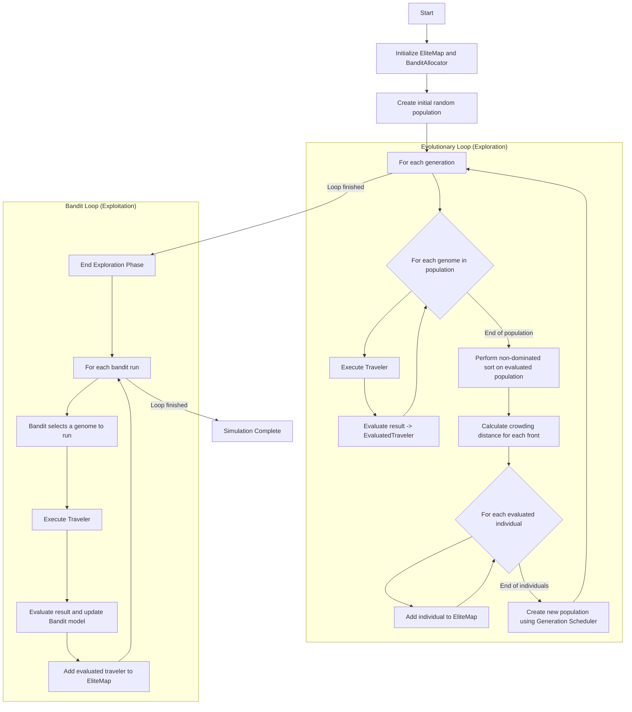

## Main Execution Flow

## Key Features

### Hybrid Exploration-Exploitation (Optional)

The system supports an **optional bandit-guided parent selection** during the evolutionary loop. By default, it uses traditional MAP-Elites with pure random selection (exploration). You can enable a hybrid approach that uses the bandit allocator to guide parent selection, trading some diversity for faster convergence to high-quality solutions.

Configure via `BANDIT_GUIDANCE_WEIGHT` in `main.py`:
- `0.0` = Traditional MAP-Elites (default)
- `0.3` = Hybrid (30% bandit-guided)
- `1.0` = Full bandit guidance

See [`docs/08_Bandit_In_Generation_Loop.md`](docs/08_Bandit_In_Generation_Loop.md) for detailed analysis.
